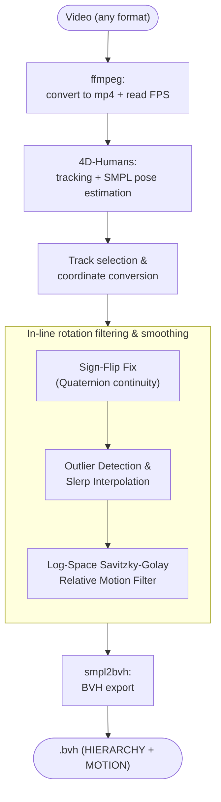

# video2bvh

Convert a video of a person into a **BVH file**, so the captured motion can be reused in 3D animation tools like Blender or Unity.

## How it works

The pipeline turns a video into a `.bvh` file in five steps:

1. **Video preprocessing** — Converts the input video to `.mp4` if needed and reads its actual frame rate (via `ffmpeg`), so the exported animation plays back at the correct speed.
2. **Human tracking & SMPL pose estimation** — Runs [4D-Humans](https://github.com/shubham-goel/4D-Humans) (`track.py`) on the video to detect and track every person in frame, estimating SMPL body pose parameters for each tracked person on every frame.
3. **Track selection & coordinate conversion** — Automatically selects the most consistently tracked person (or a manually specified track ID), corrects the orientation/coordinate system, and extracts joint rotations and root translations.
4. **Outlier clean-up & manifold-aware smoothing** — Processed directly during the PKL conversion:
   * **Quaternion Sign-Flip Fix:** Ensures quaternion continuity across frames ($+q$ and $-q$ represent the same rotation).
   * **Outlier Replacement:** Detects abrupt angular jumps per joint (using robust Z-scores on frame-to-frame distances) and interpolates bad frames via Slerp prior to smoothing.
   * **Log-Space Motion Smoothing:** Smooths relative frame-to-frame rotations (angular velocity vectors in Lie algebra / log-space) using a Savitzky-Golay filter, preventing $SO(3)$ manifold distortion artifacts.
5. **BVH export** — Converts the smoothed axis-angle sequence back into the format expected by [smpl2bvh](https://github.com/KosukeFukazawa/smpl2bvh) to produce a clean `.bvh` file at the video's original frame rate.



## BVH Skeleton Hierarchy


The exported `.bvh` uses the standard 24-joint SMPL skeleton (the same joint set `smpl2bvh` writes), rooted at the pelvis. `Pelvis` is the only joint with 6 channels (position + rotation); every other joint has 3 rotation-only channels, and each limb ends in a 0-channel `End Site` marking the tip of the hand, foot, or head.
 
From the root, the hierarchy splits into three main chains:
 
- **Left/right leg** — `hip → knee → ankle → foot → End Site`
- **Spine** — `Spine1 → Spine2 → Spine3`, which itself branches into three further chains:
  - **Neck/head** — `Neck → Head → End Site`
  - **Left/right arm** — `collar → shoulder → elbow → wrist → palm → End Site`


## Project structure

```
video2bvh/
├── main.py          # Entry point: orchestrates the full pipeline
├── 4D-Humans/       # Human tracking + SMPL pose estimation (external tool)
├── smpl2bvh/        # SMPL-to-BVH conversion (external tool)
└── .gitignore
```

## Requirements

- Python 3.10
- PyTorch
- OpenCV (`cv2`)
- `ffmpeg-python`
- NumPy, SciPy
- `joblib`
- 4D-Humans and smpl2bvh installed with their own dependencies (see each tool's own requirements/setup instructions)

## Usage

1. Make sure `4D-Humans` and `smpl2bvh` are set up in their respective folders (`./4D-Humans`, `./smpl2bvh`), including any pretrained model checkpoints they require.
2. Run the pipeline on your input video:

```bash
python main.py --video path/to/your_video.mp4 --gender NEUTRAL --output output.bvh
```

**Arguments:**

| Argument    | Required | Default      | Description                                                                 |
|-------------|----------|--------------|-------------------------------------------------------------------------------|
| `--video`   | Yes      | —            | Path to the input video (any format; non-mp4 files are converted automatically) |
| `--gender`  | No       | `NEUTRAL`    | SMPL body model gender: `MALE`, `FEMALE`, or `NEUTRAL`                        |
| `--tid`     | No       | auto-detected | Track ID of the person to export, if you don't want the most frequently tracked one |
| `--output`  | No       | `output.bvh` | Path for the final `.bvh` file                                               |

## Output

- The final motion capture data is exported as a `.bvh` file at the path given by `--output`.
- Intermediate files (converted `.mp4`, temporary `.pkl`) are cleaned up automatically after a successful run.

## References

This project uses the following open-source tools: [4D-Humans](https://github.com/shubham-goel/4D-Humans) and [smpl2bvh](https://github.com/KosukeFukazawa/smpl2bvh).
